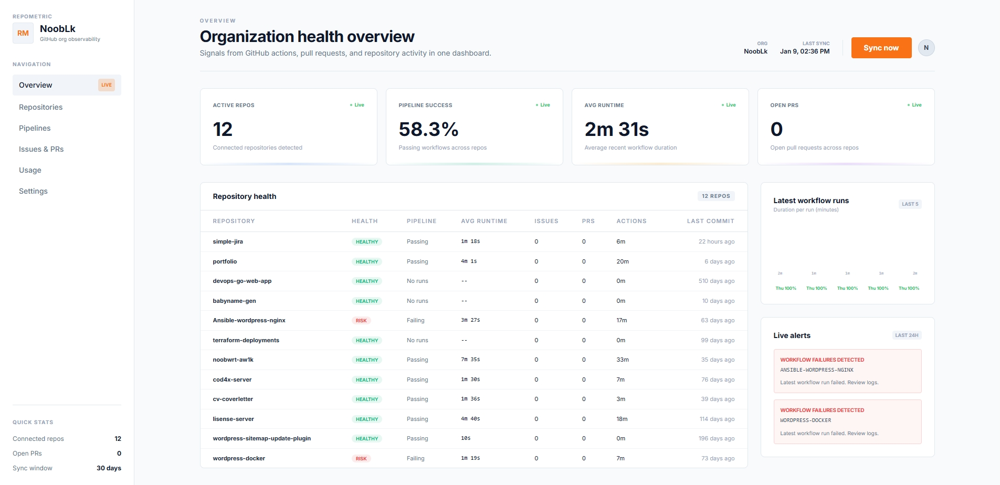
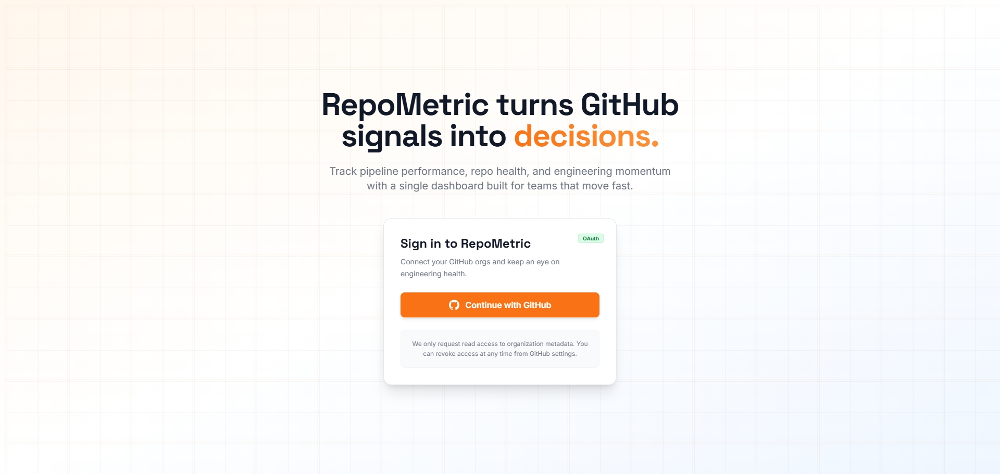

# RepoMetric

> A centralized GitHub organization observability platform for engineering teams

[](https://nextjs.org/)
[](https://www.typescriptlang.org/)
[](https://tailwindcss.com/)

## About RepoMetric

RepoMetric is a centralized GitHub organization observability platform designed to provide engineering teams with a unified view of repository health, CI/CD pipeline performance, development activity, and operational risk. 

The platform aggregates critical signals such as:
- Build status and pipeline execution time
- Commit activity and development velocity
- Issues and pull requests tracking
- GitHub Actions usage and cost monitoring

RepoMetric helps teams improve reliability, visibility, and data-driven decision making by turning scattered GitHub data into actionable insights.

## Screenshots

### Dashboard

*Real-time monitoring of repositories, CI/CD pipelines, and development metrics*

### Login

*Secure GitHub OAuth authentication*

## Features

- **GitHub OAuth Integration** - Secure authentication with GitHub
- **Multi-Repository Dashboard** - Monitor all your repositories in one place
- **CI/CD Pipeline Tracking** - Track workflow runs, execution times, and failure rates
- **Development Metrics** - Monitor commits, issues, and pull requests
- **Alert System** - Get notified about failed pipelines and critical issues
- **Responsive Design** - Works seamlessly on desktop and mobile devices

## Getting Started

### Prerequisites

- Node.js 18+ and npm
- GitHub account
- GitHub OAuth App credentials

### Installation

1. **Clone the repository**
   ```bash
   git clone https://github.com/yourusername/repometric.git
   cd repometric
   ```

2. **Install dependencies**
   ```bash
   cd apps/web
   npm install
   ```

3. **Configure environment variables**
   
   Create a `.env.local` file in `apps/web`:
   ```env
   GITHUB_CLIENT_ID=your_github_client_id
   GITHUB_CLIENT_SECRET=your_github_client_secret
   ```

4. **Start the development server**
   ```bash
   npm run dev
   ```

5. **Open your browser**
   
   Navigate to [http://localhost:3000](http://localhost:3000)

## Documentation

- **[Development Guide](docs/development.md)** - Project structure, setup instructions, and development notes
- **[Roadmap](docs/roadmap.md)** - Implementation progress and upcoming features
- **[CI/CD Pipeline](docs/ci-cd-pipeline.md)** - Continuous integration and deployment setup

## Tech Stack

- **Frontend**: Next.js 14 (App Router), React, TypeScript
- **Styling**: Tailwind CSS
- **Authentication**: GitHub OAuth
- **Data Fetching**: GitHub REST API
- **Deployment**: Vercel (recommended)

## Project Structure

```
repometric/
├── apps/
│   └── web/                 # Next.js web application
│       ├── src/
│       │   ├── app/        # App router pages
│       │   ├── components/ # React components
│       │   ├── hooks/      # Custom hooks
│       │   ├── lib/        # Utilities and helpers
│       │   └── providers/  # Context providers
│       └── package.json
├── docs/                    # Documentation
└── images/                  # Screenshots and assets
```

## Contributing

Contributions are welcome! Please feel free to submit a Pull Request.

## License

This project is licensed under the terms specified in the [LICENSE](LICENSE) file.

## Links

- [GitHub Repository](https://github.com/yourusername/repometric)
- [Issue Tracker](https://github.com/yourusername/repometric/issues)

---

**Note**: This is currently a private project with plans for a public release in the future.